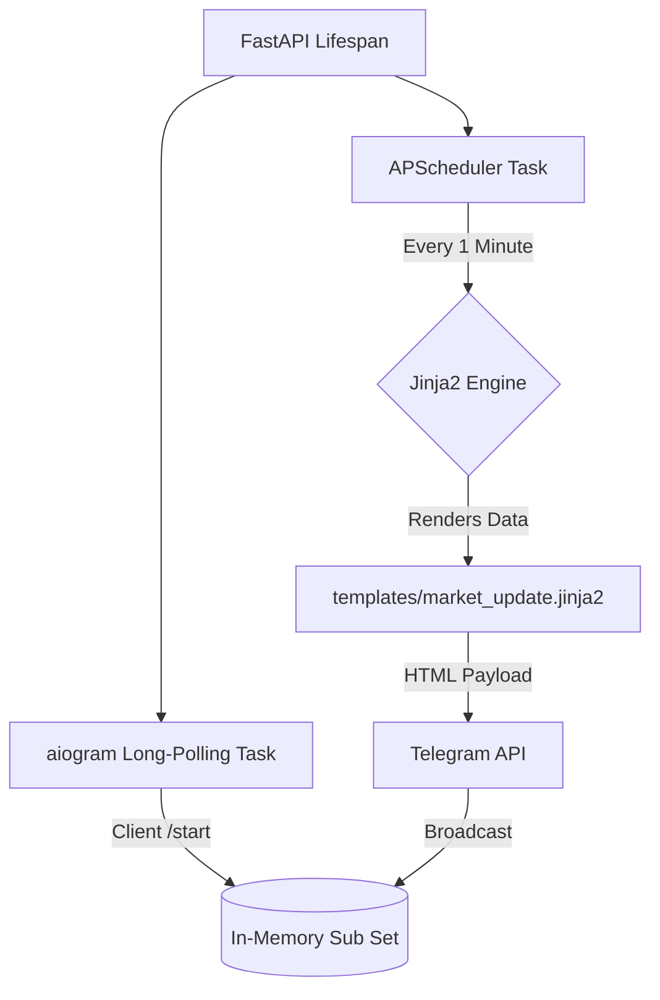

# Enterprise Telegram Bot with Jinja2 Templating


An asynchronous Telegram broadcasting engine integrated directly within a **FastAPI** lifecycle. It utilizes **Jinja2** for dynamic HTML message rendering (supporting expandable blockquotes) and **APScheduler** for automated job execution.

## 🧠 Architecture Flow



## 🚀 Quick Start (Docker)

1. Get a Bot Token from [@BotFather](https://t.me/BotFather).
2. Insert your token into `docker-compose.yml` under `TELEGRAM_BOT_TOKEN`.
3. Start the engine:
   ```bash
   docker compose up -d --build
   ```
4. Send `/start` to your bot in Telegram to subscribe.
5. Wait 60 seconds for the automated broadcast, or trigger it manually via the API:
   ```bash
   curl -X POST http://localhost:8099/v1/trigger-broadcast
   ```